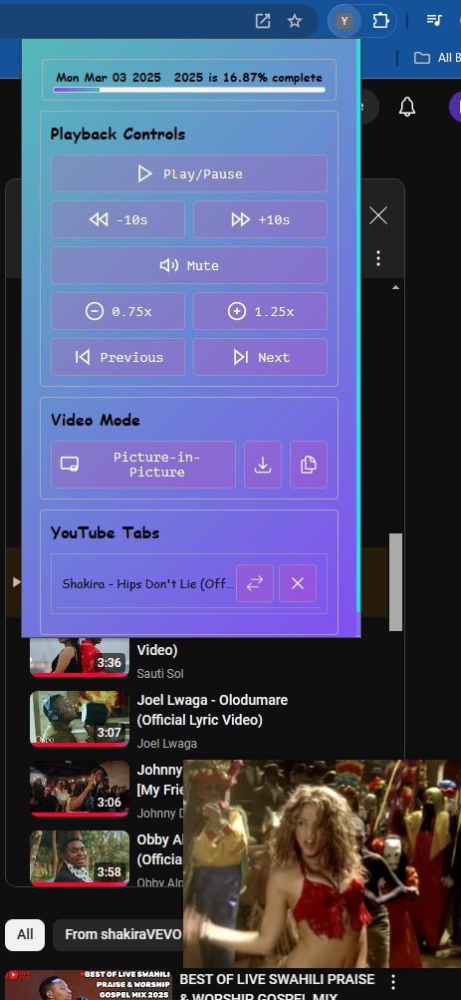

## Chrome extensions

### Youtube playback controls



# YouTube Ad Blocker & Video Controller Extension

This Chrome extension provides a convenient way to control YouTube videos and toggle an ad blocker. It offers basic playback controls, Picture-in-Picture (PiP) mode, and ad-blocking functionality across all active YouTube tabs.

## Features
- Toggle Play/Pause, Mute, Speed Control, Skip Forward/Backward.
- Switch between active YouTube tabs directly from the extension popup.
- Automatic ad-blocking for all YouTube tabs (when enabled).
- Toggle ad blocker state from the popup.
- Persistent ad blocker state saved using `chrome.storage.local`.

## Installation
1. **Clone or Download the Repository**
   ```bash
   git clone https://github.com/your-username/your-repo.git
   ```
2. **Open Chrome Extensions Page**
   - Navigate to `chrome://extensions/` in your Chrome browser.

3. **Enable Developer Mode**
   - Toggle the `Developer mode` switch located in the top-right corner.

4. **Load Unpacked Extension**
   - Click on `Load unpacked` and select the root folder of this project.

5. **The extension is now installed and ready to use!**

## How to Use
- Click the extension icon to open the popup.
- Toggle the Ad Blocker using the `Blocker Enabled/Disabled` button.
- Use other controls (Play/Pause, PiP, etc.) to interact with the currently active YouTube tab.

## Important Notes
- By default, the ad blocker is **enabled** when you first install the extension.
- New YouTube tabs are automatically controlled by the ad blocker.

## Troubleshooting
- Make sure you have granted the required permissions (`tabs`, `scripting`, `storage`) in your `manifest.json` file.
- Reload the extension if you make changes to the source code.

## Permissions Required
```json
"permissions": [
  "tabs",
  "scripting",
  "storage"
]
```

## License
This project is licensed under the MIT License - see the [LICENSE](LICENSE) file for details.

### Improvements:
✅ Step 1: Build a Playlist Manager (Categorizing, Filtering, Playback Progress Management)

✅ Step 2: Visualize Listening Habits (Graphs & Stats)

✅ Step 3: Recommendation System (Suggest Related Songs)

✅ Step 4: Export & Share Playlists

✅ Step 5: Search & Filter System

✅ Step 6: Downloading Videos Locally
